# RentFux – Funktionsumfang

Premium-Autovermietung für Privat- und Geschäftskunden. Deutschsprachige Web-Plattform mit Kundenbereich, Gastbuchung und vollständigem Admin-Dashboard.

**Tech-Stack:** FastAPI · MongoDB · React · TailwindCSS · Shadcn/UI · Emergent Object Storage
**Aktueller Modus:** Zahlungen & Benachrichtigungen sind **MOCKED** (kein echter Geldfluss, keine echten E-Mail/WhatsApp)

---

## Übersicht der Seiten (Screenshots)

| Landingpage | Fahrzeugkatalog |
|:-:|:-:|
| 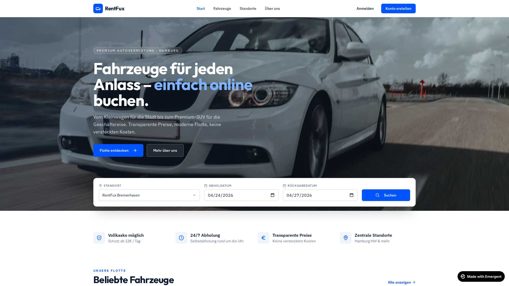 | 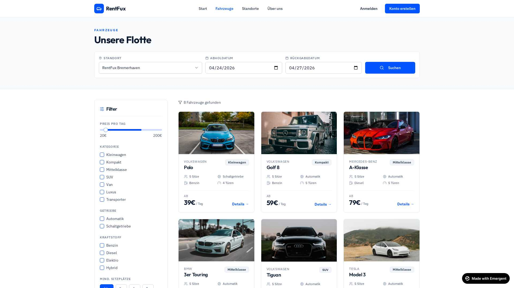 |
| **Fahrzeug-Detail** | **Buchungs-Flow (Gast)** |
| 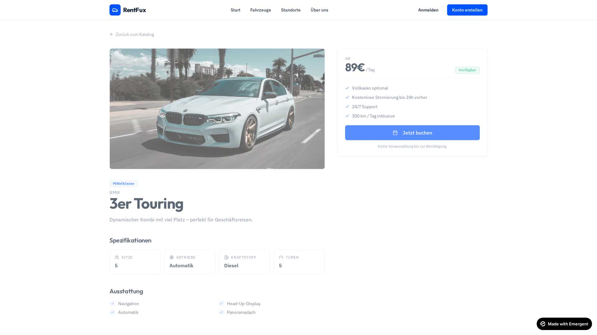 | 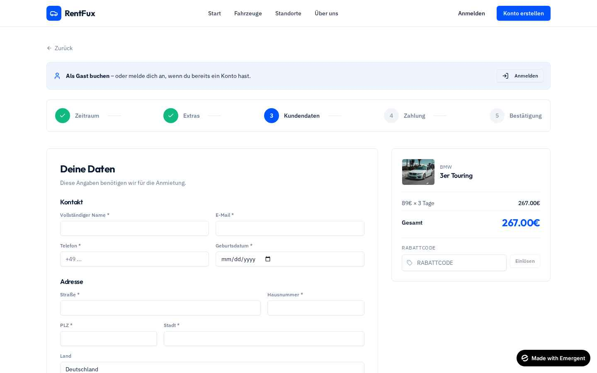 |
| **Login** | **Mein Konto** |
| 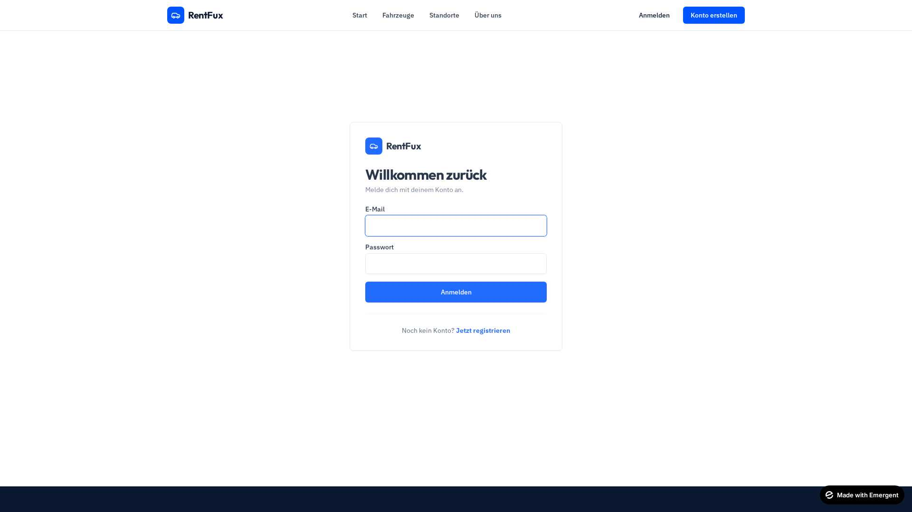 | 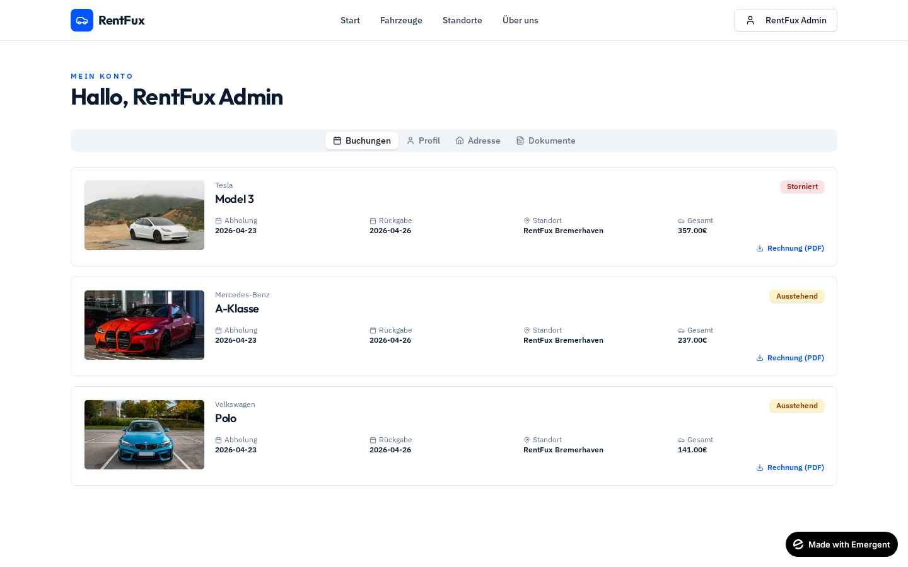 |

---

## 1. Öffentlicher Bereich (Gäste & Kunden)

### Landingpage (`/`)

- Hero mit Fahrzeug-Bildhintergrund und prominenter Suchleiste (Standort, Abholdatum, Rückgabedatum)
- Trust-Icons: Vollkasko, 24/7-Abholung, transparente Preise, zentrale Standorte
- Featured-Fahrzeuge (bis zu 6 aus der Flotte)
- „So funktioniert's" 4-Schritte-Erklärung
- Testimonial-Sektion

### Fahrzeugkatalog (`/katalog`)

- Live-Suche + Sticky-Filter-Sidebar
- **Filter:** Preisbereich (Slider), Kategorie, Getriebe, Kraftstoff, Mindest-Sitzplätze
- Grid mit Fahrzeugkarten (Bild, Marke, Modell, Specs, Preis/Tag)
- Hover-Animation, Responsive (1–3 Spalten)

### Fahrzeug-Detail (`/fahrzeug/:id`)

- Große Bildgalerie
- Vollständige Spezifikationen: Sitze, Getriebe, Kraftstoff, Türen
- Ausstattungsliste (Features)
- Sticky Buchungs-Sidebar mit Preis, Verfügbarkeits-Badge, „Jetzt buchen"-CTA
- Info: Vollkasko, kostenlose Stornierung 24h, 24/7-Support, 300 km/Tag inkl.

### Standorte (`/standorte`)
- Kartenansicht aller Standorte
- Adresse, PLZ, Stadt, Telefon (`tel:`), E-Mail (`mailto:`)
- Öffnungszeiten (24/7 Selbstabholung)

### Über uns (`/ueber-uns`)
- Unternehmensphilosophie (4 Werte)
- Kennzahlen-Highlights

---

## 2. Authentifizierung

### Login (`/login`)

### Registrierung (`/registrieren`)
- E-Mail, Passwort (min. 6 Zeichen), Name, Telefon (optional)
- Erstellt JWT + httpOnly-Cookies
- Nach Registrierung automatische Weiterleitung zum **Profil-Setup-Wizard** (`/konto/einrichten`)

### Login
- E-Mail + Passwort
- Brute-Force-Schutz: 5 Fehlversuche → 15 Min Sperre
- Admin wird automatisch zum Admin-Bereich geleitet
- Redirect-Parameter unterstützt (nach Login zur ursprünglichen Seite)

### Profil-Setup-Wizard (`/konto/einrichten`)
5-stufiger geführter Onboarding-Flow nach Registrierung:
1. **Persönlich:** Telefon, Geburtsdatum, Geschäftskunden-Toggle (+ Firmendaten)
2. **Adresse:** Straße, Hausnummer, PLZ, Stadt, Land
3. **Führerschein & Ausweis:** Nummern + Gültigkeit
4. **Dokumente:** Upload Führerschein + Personalausweis (optional)
5. **Fertig:** Abschluss, Navigation zum Katalog oder Konto
- „Später erledigen" springt direkt zur Startseite
- Fortschritt wird nach jedem Schritt gespeichert

### Auth-Sicherheit
- Bcrypt-Passwort-Hashing
- JWT mit 8h Access-Token + 7-Tage Refresh-Token
- HttpOnly, Secure, SameSite=None Cookies
- Auch `Authorization: Bearer <token>`-Header unterstützt

---

## 3. Mein Konto (`/konto`) – Eingeloggte Kunden

### Tabs
| Tab | Inhalt |
|-----|--------|
| **Buchungen** | Komplette Historie mit Fahrzeugbild, Status-Badge, Zeitraum, Standort, Gesamtsumme, **PDF-Download-Link** |
| **Profil** | Name, Telefon, E-Mail (readonly), Geburtsdatum, Führerschein-Nr., Gültigkeit, Personalausweis-Nr. |
| **Adresse** | Straße, Hausnummer, PLZ, Stadt, Land |
| **Firma** | Toggle „Geschäftskunde" + Firmenname, USt-IdNr., Ansprechpartner |
| **Dokumente** | Upload/Preview/Löschen für Führerschein & Personalausweis (JPG/PNG/WEBP/PDF, max 5 MB) |

### Profil-Unvollständig-Badge
- Erscheint im Header, wenn Pflichtdaten oder Dokumente fehlen

---

## 4. Buchungsflow (`/buchen/:vehicleId`)

**5-Schritt-Stepper** mit Shadcn-Progress-UI. Funktioniert **für Gäste (ohne Anmeldung) und für registrierte Kunden**.

### Schritt 1 – Zeitraum
Standort-Dropdown + Abhol-/Rückgabedatum

### Schritt 2 – Extras
- Navigation (+5€/Tag)
- Kindersitz (+7€/Tag)
- Zusatzfahrer (+8€/Tag)
- Vollkasko (+12€/Tag)
- WLAN-Hotspot (+4€/Tag)

### Schritt 3 – Kundendaten
**Für eingeloggte Kunden:**
- Profil-Pflichtcheck: Banner zeigt fehlende Daten + „Profil vervollständigen"-Button
- Inline-Felder: Name, Telefon, Anmerkung

**Für Gäste:**
- Vollständiges Formular: Name, E-Mail, Telefon, Geburtsdatum
- Adresse: Straße, Hausnummer, PLZ, Stadt, Land
- Führerscheinnummer + Gültigkeit
- Personalausweis-Nummer (optional)

### Schritt 4 – Zahlung
- Radio-Auswahl: Kreditkarte (Stripe) / PayPal
- Info-Box „Demo-Modus: Zahlungen MOCKED"
- **Nur für Gäste:** Toggle „Kundenkonto erstellen?" + Passwortfeld
- „Jetzt zahlen · XX.XX€"-Button mit Live-Gesamtsumme

### Schritt 5 – Bestätigung
- Grüner Erfolgs-Check
- Buchungsnummer (8 Zeichen)
- Zusammenfassung: Fahrzeug, Zeitraum, Tage, Standort, Gesamt
- „Konto erstellt"-Hinweis (wenn Gast + Kontoerstellung)
- **Rechnung als PDF herunterladen**
- Navigation zu „Meine Buchungen" oder „Weitere Fahrzeuge"

### Rabattcode-Eingabe
- In der Sidebar während aller Schritte sichtbar
- Validierung in Echtzeit
- Grüne Anzeige nach Einlösung mit X-Button zum Entfernen
- Einfluss wird live in Gesamtsumme übernommen und auch im PDF gezeigt

### Verfügbarkeitsprüfung
- Überlappende Buchungen → HTTP 409 „Fahrzeug in diesem Zeitraum nicht verfügbar"
- Separater Endpoint `GET /api/vehicles/{id}/availability?start=X&end=Y`

---

## 5. Admin-Dashboard (`/admin`) – Rolle: admin

### Sidebar-Navigation
- Dashboard · Fahrzeuge · Buchungen · Standorte · Kunden · Rabattcodes

### 5.1 Dashboard (`/admin`)
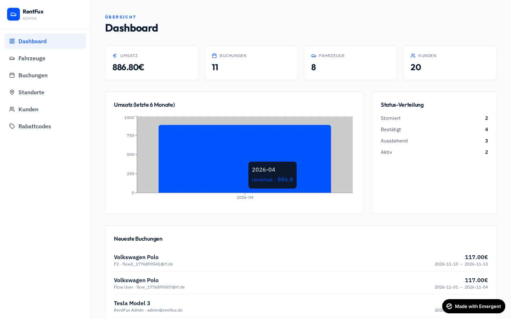

- **KPI-Kacheln:** Umsatz, Buchungen, aktive Fahrzeuge, Kunden
- **Balkendiagramm:** Umsatz der letzten 6 Monate (Recharts)
- **Status-Verteilung:** Pending/Confirmed/Active/Completed/Cancelled-Zähler
- **Neueste Buchungen:** letzte 5 Einträge

### 5.2 Fahrzeuge (`/admin/fahrzeuge`)
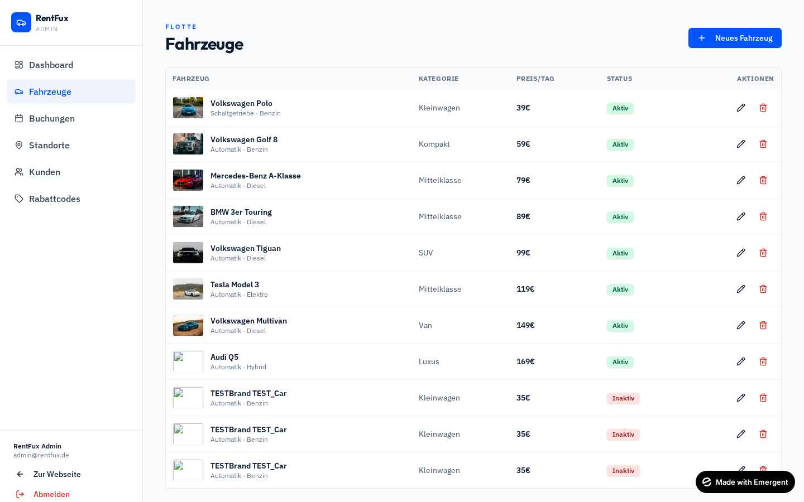

- Tabellenübersicht mit Thumbnail, Marke/Modell, Kategorie, Preis, Aktiv-Status
- **Neues Fahrzeug** Dialog: Marke, Modell, Kategorie, Getriebe, Kraftstoff, Sitze, Türen, Preis/Tag, Standort, Bild-URL, Beschreibung, Features (Komma-getrennt)
- Bearbeiten · Deaktivieren (Soft-Delete)

### 5.3 Buchungen (`/admin/buchungen`)
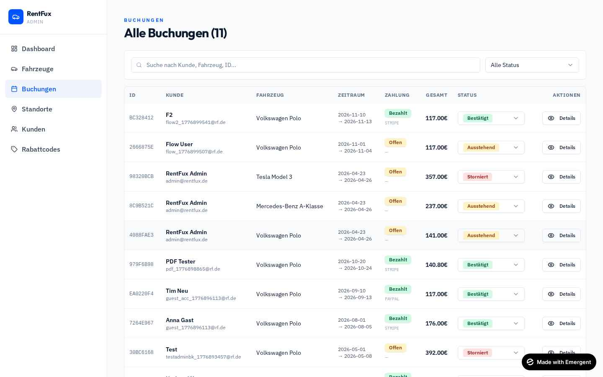

- Volltextsuche (Kunde, Fahrzeug, Buchungs-ID)
- Status-Filter
- Tabelle mit 8 Spalten inkl. Inline-Status-Dropdown & „Details"-Button
- Zahlungsstatus-Badge (Bezahlt/Offen)

### 5.4 Buchungs-Detail (`/admin/buchungen/:id`)
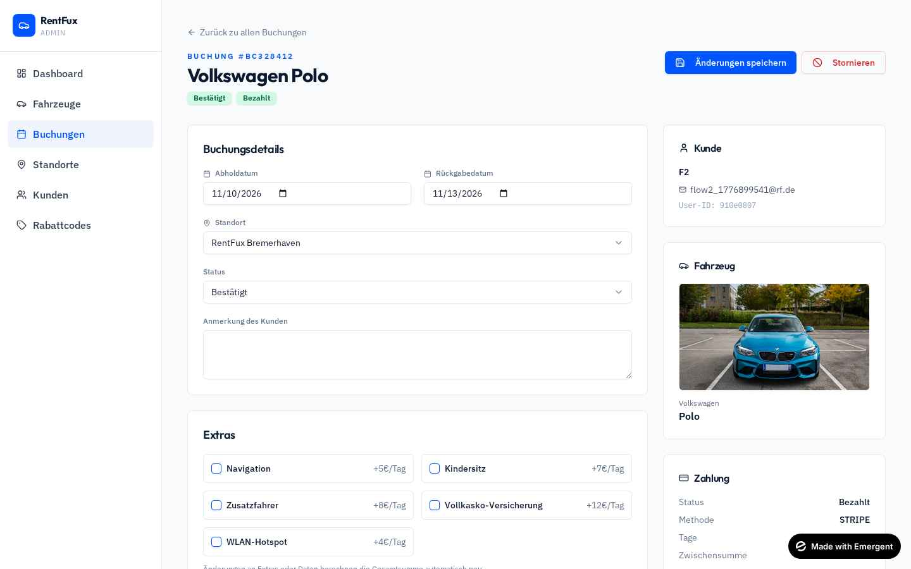

- **Bearbeitbar:** Datum (Preis wird automatisch neu berechnet), Standort, Status, Extras, Kundenanmerkung
- **Stornieren-Button** mit AlertDialog-Bestätigung
  - Setzt Status auf „Storniert" und gibt das Fahrzeug wieder frei
- Sidebar mit Kundendaten, Fahrzeug-Karte, Zahlungsdetails, Zeitstempeln (erstellt/bezahlt/storniert/aktualisiert)

### 5.5 Standorte (`/admin/standorte`)
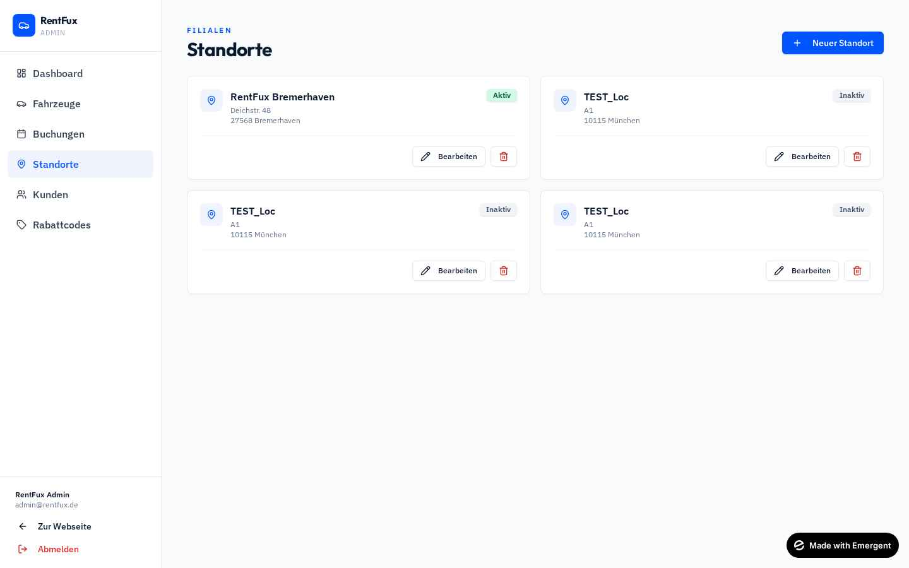

- Grid-Übersicht
- CRUD-Dialog: Name, Adresse, PLZ, Stadt, Telefon, E-Mail, Aktiv-Toggle
- Telefon & E-Mail werden live im **Footer und auf der Standorte-Seite** angezeigt

### 5.6 Kunden (`/admin/kunden`) + Detail (`/admin/kunden/:id`)
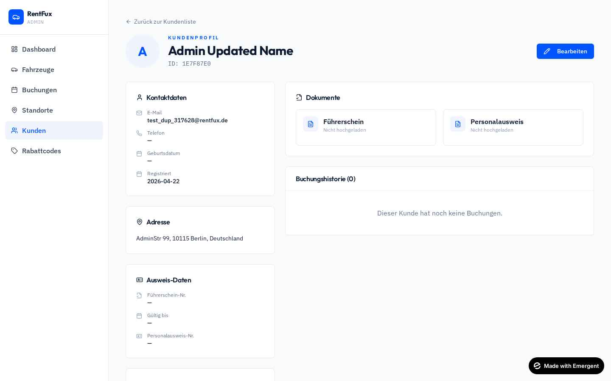

- Tabelle: Avatar, Name, E-Mail, Telefon, Registriert, Buchungsanzahl, Details-Button
- Kundenprofil mit **Geschäftskunde-Badge**
- **Sidebar-Karten:** Kontaktdaten · Adresse · Firmen-Infos (wenn Geschäftskunde) · Ausweis-Daten · Kennzahlen (Buchungen, Umsatz, Abgeschlossen/Storniert/Aktiv)
- **Dokumente-Sektion:** Inline-Preview (Bilder) oder iframe (PDFs) + „In neuem Tab öffnen"
- **Buchungshistorie** mit Verlinkung zu jeweiligen Buchungs-Details
- **Bearbeiten-Button** öffnet Dialog zur Vollbearbeitung aller Kundendaten (inkl. Firma)

### 5.7 Rabattcodes (`/admin/rabatte`)
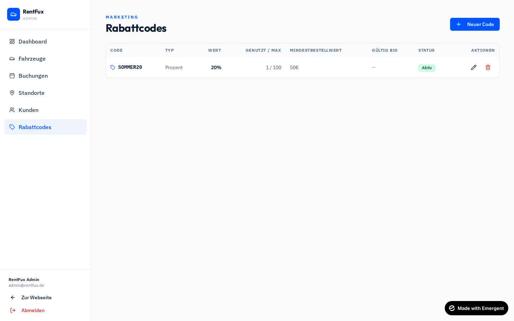

- Tabelle: Code, Typ, Wert, Nutzung, Mindestbestellwert, Gültigkeit, Status
- Dialog zum Anlegen/Bearbeiten:
  - Code (eindeutig, Großbuchstaben)
  - Typ: **Prozent** oder **Festbetrag**
  - Wert, Mindestbestellwert, max. Nutzungen, Gültig-bis
  - Aktiv-Toggle
- Validierungen beim Einlösen: aktiv, nicht abgelaufen, Kontingent nicht aufgebraucht, Mindestbestellwert erreicht

---

## 6. Backend-API (`/api/...`)

### Auth
| Methode | Pfad | Beschreibung |
|---------|------|--------------|
| POST | `/auth/register` | Registrierung |
| POST | `/auth/login` | Login (mit Rate-Limit) |
| POST | `/auth/logout` | Logout |
| GET | `/auth/me` | Aktuellen Benutzer abrufen |
| PATCH | `/auth/profile` | Profildaten aktualisieren |
| GET | `/auth/profile-status` | `{complete, missing[]}` für Buchungspflichtcheck |

### Fahrzeuge
| Methode | Pfad | Beschreibung |
|---------|------|--------------|
| GET | `/vehicles` | Liste mit Filtern (category, transmission, fuel, seats_min, price_min/max, search) |
| GET | `/vehicles/{id}` | Detail |
| GET | `/vehicles/{id}/availability` | `{available}` |
| POST/PUT/DELETE | `/vehicles[/{id}]` | Admin-CRUD |
| GET | `/admin/vehicles` | Alle inkl. inaktive |

### Standorte
| Methode | Pfad |
|---------|------|
| GET | `/locations` (aktive) |
| GET | `/admin/locations` |
| POST/PUT/DELETE | `/locations[/{id}]` (Admin) |

### Buchungen
| Methode | Pfad | Beschreibung |
|---------|------|--------------|
| POST | `/bookings` | Eingeloggte User, erfordert vollständiges Profil |
| POST | `/bookings/guest` | **Gast-Buchung** – One-Shot (Validierung, optionaler Account, Zahlung) |
| POST | `/payments/mock-pay` | Zahlung für Booking (mock) |
| GET | `/bookings/me` | Meine Buchungen |
| GET | `/bookings/{id}` | Einzelne Buchung (owner or admin) |
| GET | `/bookings/{id}/invoice` | **PDF-Rechnung** |
| GET | `/admin/bookings` | Alle Buchungen |
| GET | `/admin/bookings/{id}` | Admin-Detail |
| PATCH | `/admin/bookings/{id}` | Flexibel updaten (Datum/Status/Extras/Standort/Note → Recalc) |
| POST | `/admin/bookings/{id}/cancel` | Stornieren mit Zeitstempel |

### Kunden (Admin)
| Methode | Pfad |
|---------|------|
| GET | `/admin/customers` |
| GET | `/admin/customers/{id}` (User + Buchungen + Stats) |
| PATCH | `/admin/customers/{id}` |
| GET | `/admin/customers/{id}/documents/{doc_type}` |

### Dokumente
| Methode | Pfad |
|---------|------|
| POST | `/uploads/documents/{doc_type}` (license / id_card) |
| GET | `/uploads/documents/me/{doc_type}` |
| DELETE | `/uploads/documents/{doc_type}` |

### Rabattcodes
| Methode | Pfad |
|---------|------|
| POST | `/bookings/apply-discount` (Vorschau) |
| GET/POST/PUT/DELETE | `/admin/discounts[/{code}]` |

### Statistik (Admin)
| Methode | Pfad |
|---------|------|
| GET | `/admin/stats` (Umsatz, Buchungen, Fahrzeuge, Kunden, Monatschart, Status-Verteilung) |

---

## 7. Datenmodelle (MongoDB)

| Collection | Felder (Kurzfassung) |
|------------|---------------------|
| **users** | id, email, password_hash, name, phone, role, date_of_birth, address{…}, license_number, license_expiry, id_card_number, is_business, company{company_name, vat_id, contact_person}, documents{license, id_card}, created_at |
| **vehicles** | id, name, brand, category, transmission, fuel, seats, doors, price_per_day, image_url, description, features[], active, location_id, created_at |
| **locations** | id, name, address, postal_code, city, phone, email, active |
| **bookings** | id, user_id, user_email, user_name, is_guest, guest_customer{…}, vehicle_{id,name,brand,image}, location_{id,name}, start_date, end_date, days, extras[], extras_total, subtotal, discount_code, discount_amount, total, status, payment_{status,method}, customer_note, created_at, paid_at, cancelled_at, updated_at |
| **discount_codes** | code, type (percent/fixed), value, min_total, max_uses, used_count, valid_until, active, created_at |
| **login_attempts** | identifier (ip:email), count, lock_until, updated_at |

---

## 8. Object Storage (Emergent)

- Pfadschema: `rentfux/users/{user_id}/{doc_type}/{uuid}.{ext}`
- Zugriff nur über authentifizierte Backend-Endpoints (Streaming über Backend-Proxy)
- Erlaubte Dateitypen: JPG, JPEG, PNG, WEBP, PDF
- Maximale Größe: **5 MB**

---

## 9. Sicherheit & Validierung

- Rolle-basierte Zugriffskontrolle (User vs Admin)
- Profil-Pflichtcheck vor Buchung (Name, Telefon, Geburtsdatum, Führerschein-Nr., Adresse, Führerschein + Ausweis Upload, ggf. Firmenname)
- Owner-Check auf Buchungsdetails
- Brute-Force-Schutz beim Login
- Alle Fehler liefern deutsche Klartext-Meldungen
- MongoDB `_id` wird in allen Responses ausgeschlossen

---

## 10. Rechnungs-PDF

Automatisch generierte PDF mit RentFux-Branding:
- Header: Logo, „Buchungsbestätigung", Buchungsnummer, Datum
- Kunde + Abholstation
- Buchungsdetails: Fahrzeug, Zeitraum, Tage, Zahlungsmethode, Status
- Abrechnungspositionen (Fahrzeug, Extras, **Rabatt**, Gesamtbetrag)
- Footer: Firmenadresse, Hinweis „Führerschein & Ausweis mitbringen"

---

## 11. Design-System

- **Farben:** Primär #0055FF · Navy #0A192F · Surface #F8FAFC · Accent Emerald #10B981
- **Schriftarten:** Outfit (Display/Headlines), IBM Plex Sans (Body)
- **Hintergrund:** Überall hell, keine dunklen Body-Flächen (Ausnahme: Footer, Hero-Overlay)
- **Komponenten:** Shadcn/UI (Button, Input, Select, Tabs, Dialog, AlertDialog, Badge, Checkbox, Switch, Slider, RadioGroup, Sonner-Toaster)
- **Icons:** Lucide React
- **Animationen:** Fade-in auf Seitenwechsel, Card-Hover, Stepper-Übergänge
- **Responsive:** Mobile-first, Admin-Sidebar ab `md:`, Scroll-Navigation mobil

---

## 12. Roadmap / Noch offen

- Echte Zahlung (Stripe / PayPal live)
- Echte E-Mail (SendGrid) & WhatsApp (Twilio)
- Bewertungssystem für abgeschlossene Buchungen
- Mehrsprachigkeit DE/EN (Umschalter)
- GPS-Tracking der Fahrzeuge
- Mehrere Filialen / Standortübergreifende Flottenansicht
- Firmenkonditionen / Rabatt-Tiers für Geschäftskunden
- Fahrzeug-Terminplaner (Kalendersicht)

---

## 13. Standard-Zugangsdaten (Entwicklung)

- **Admin:** `admin@rentfux.de` / `Admin123!`
- **Rabattcode-Beispiel:** `SOMMER20` (20% Rabatt, Mindestbestellwert 50€)
